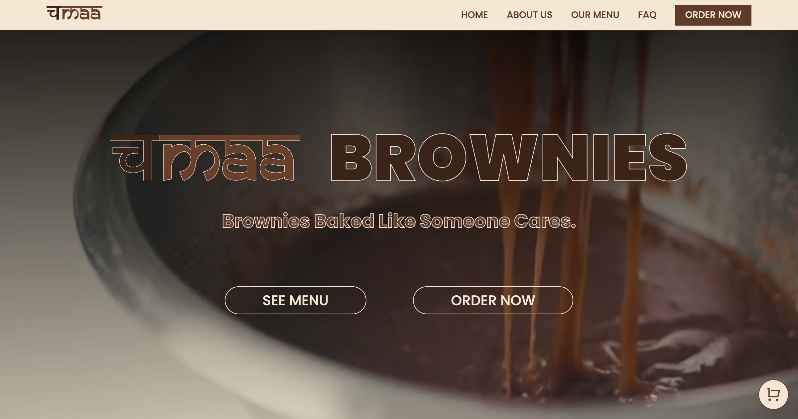

<h1>Chamaa Brownies</h1>

चmaa is a small online cloud kitchen tha sales best brownies in kathmandu.

I created the logo for this, and I designed everything.

<h3>Logo:</h3>

<h3>Favicon:</h3>

and

the images and videos were taken from internet. copyright of all images and videos that i didnt create are hold by their respective owner.

<h2>Tech Stack:</h2>
<ul>
<li>HTML</li>
<li>CSS</li>
<li>JS</li>
</ul>

<h2>Features:</h2>
<ul>
<li>Clean and simple design.</li>
<li>Fully responsive to all size devices</li>
<li>Order is taken through WhatsApp</li>
</ul>

<h3>Live Demo:</h3>
<a href="https://chamaa-brownies.netlify.app" target="_blank" style="text-decoration: underline;">click me!</a>

<h3>Github Repo Link:</h3>
<a href="https://github.com/rojen-chakradhar/chamaa" target="_blank" style="text-decoration: underline;">click me!</a>